## Week 9: Searching and Sorting (Ideas)


### Searching:

- **Linear Search:** Search the desired element one by one. *(Thus used in the linear data structures)*

  <br>

```java
//Here is an example Array:
 int[] arr = [7, 16, 4, 9, 13, 2, 8]
     
//Suppose we want to find the number 13:
//The algorithm will go through the elements within a data structure ONE BY ONE
//In our case: Search through 7 -> 16 -> 4 -> 9 and finally 13


//COMPLEXITY: O(n)  
public int linearSearch(int[] arr, int element) {
    for(int i = 0;i < arr.length; i++) {
        if(arr[i] == element) {
           return i;
        }
    return -1;
} 
     
```

<br>

<br>


- **Binary Search:** Search an element in a **sorted** array by repeatedly dividing the search interval in half.

<br>

```java
//Here is an example Array:
 int[] arr = [4, 6, 9, 25, 27, 31, 40]
     
//Suppose we want to find the number 4:
//The algorithm will first check the MIDDLE INDEX: 25 (index 3)  > 4
//As a result, the right half of 25 will be discarded, and a new searching area formed:
            newArr = [4, 6, 9]    
     
//Repeat the previous steps, by the time there is only one/no element in the searching array, 
//the algorithm stops. 


   //COMPLEXITY: O(logn)     
   public int binarySearch(int[] arr, int element) {
     int start = 0;
     int end = arr.length - 1;
     
    while(start <= end) {
        int mid = start + ( end - start ) / 2;
        
        if(arr[mid] == element) {
            return mid;
        }
        
        else if(arr[mid] < element) {
            start = mid + 1;
        }

        else {
            end = end + 1;
        }
    }
   return -1;
  }

```

<br>

<br>


### Sorting:


## Week 10: LinkedLists

- The LinkedList here is an **Abstract Data Type (ADT)**. This indicates it's not actually implemented, but a data type defined by its behavior from the point of view of a user, rather than by its implementation. 

  <br>

- Normally, **LinkedNode** serves as a single element within a LinkedList, whereas in each Node, it includes the *data* and *reference(s)* depending on the type of the LinkedList(Singly or Doubly-connected).

​       <br>

- For a **Singly-LinkdeList**:

  1. *WITHOUT* the Tail node reference: Adding at the very front can be the most efficient way: O(1). Inserted node becomes the new Head.

  2. *WITH* the Tail node reference: Adding at the very back: O(1). Inserted node becomes the new Tail.

  3. Removing an element from a random index takes O(n). (*Mainly due to the process of SEARCHING*).

     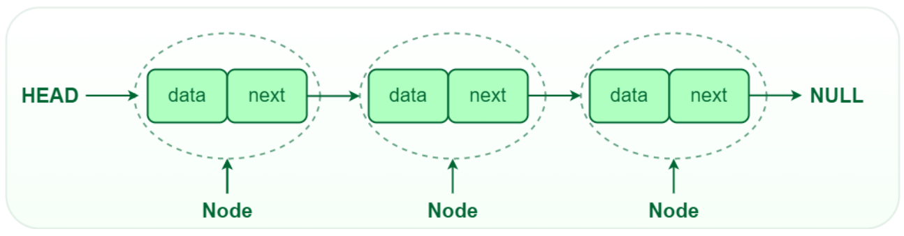

     <br>
     
     <br>
     
     
     
     

- For a **Doubly-LinkedList:**

  1. INSERT/REMOVE at/from the *beginning or the end* is O(1).
  
  2. All other operations are in O(n).
  
     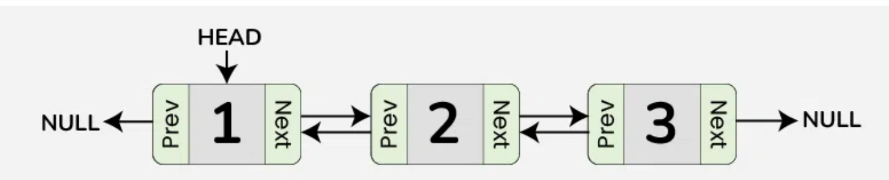
  
     <br>
  

### Singly-LinkedList Implementation:

```java
//ListADT interface
public interface ListADT<T> {
    
    //General methods
    public void add(T thingToAdd);
    public boolean contains(T thingToCheck);
    public int size();
    public boolean isEmpty();
    
    //Methods assuming an ordered list
    public void add(T thingToAdd, int index);
    public T get(int index);
    public int indexOf(T thingToCheck);
    public T remove(int index);
    
}
```

<br>

```java
//Here is the LinkedNode class
public class LinkedNode<T> {
    
    //Data fields
    private T data;
    private LinkedNode<T> next;
    
    //Constructor #1
    public LinkedNode (T data) {
        this(data, null);
    }
    
    //Constructor #2
    public LinkedNode (T data, LinkedNode<T> next) {
        this.data = data;
        this.next = next;
    }
    
    //Accessors
    public T getData() {
        return this.data;
    }
    
    public LinkedNode<T> getNext() {
        return this.next;
    }
    
    //Mutator
    public void setNext(LinkedNode<T> next) {
        this.next = next;
    }

}
```

<br>

```java
//LinkedList class
public class LinkedList implements ListADT<Integer> {
    
    //Data fields
    private LinkedNode<Integer> head;
    private LinkedNode<Integer> tail;
    private int size;
    
    //Note: Here we actually do not need a constructor
    //All the fields are initialized as NULL or ZERO
    
    
    @Override
    public boolean isEmpty() {
        return this.head == null && this.tail == null 
            && this.size() == 0;
    }
    
    @Override
    public int size() {
        return this.size;
    }
    
    @Override
    public void add(Integer newObject) {
        if (this.isEmpty()) {
            this.head = new LinkedNode<Integer>(newObject);
            this.tail = this.head;
        }
        else {
            LinkedNode<Integer> newNode = 
                new LinkedNode<Integer>(newObject);
            this.tail.setNext(newNode);
            this.tail = this.tail.getNext();
        }
        this.size++;
    }
    
    @Override
    public boolean contains(Integer findObject) {
        LinkedNode<Integer> current = this.head;
        while (current != null) {
            if (current.getData().equals(findObject)) {
                return true;
            }
            current = current.getNext();
        }
        return false;
    }
    
    
    @Override
    //Assume the index is VALID
    public void add(int index, Integer newObject) {
        //Add at first
        if (index == 0) {
            LinkedNode<Integer> newNode = 
                new LinkedNode(newObject, this.head);
            this.head = newNode;
        }
       
        
        //Add in the middle
        else if (index < size) {
            LinkedNode<Integer> temp = this.head;
            
            for (int i = 0; i < index - 1; i++) {
                temp = temp.getNext();
            }
            
            LinkedNode<Integer> newNode = 
                new LinkedNode<Integer>(newObject, temp.getNext());
            temp.setNext(newNode);
        }
        
        //Add to the back
        else {
            this.add(newObject);
            //We return from here to avoid INCREASE SIZE DUPLICATELY
            return;
        }
        this.size++;
    }
    
    
    @Override
    //Assume the index is VALID
    public Integer get(int index) {
        if (this.isEmpty()) {
            return null;
        }
        
        LinkedNode<Integer> current = this.head;
        for (int i = 0; i < index; i++) {
            current = current.getNext();
        }
        return current.getData();
    }
    
    
    @Override
    public int indexOf(Integer findObject) {
        LinkedNode<Integer> current = this.head;
        int index = 0;
        
        while (current != null) {
            if (current.getData().equals(findObject)) {
                return index;
            }
            current = current.getNext();
            index++;
        }
        return -1;
    }
    
    
    @Override
    //Assume the index is VALID
    public Integer remove(int index) {
        if (this.isEmpty()) {
            return -1;
        }
        
        LinkedNode<Integer> removed = this.head;
        //Removing the first element
        if (index == 0) {
            //REMOVING THE FIRST ELEMENT WITH ONLY ONE ELEMENT
            if (this.size() == 1) {
                this.head = null;
                this.tail = null;
            }
            //OTHER SCENARIOS
            else {
                this.head = this.head.getNext();
            }
        }
        
        //Removing other elements
        else {
            LinkedNode<Integer> current = this.head;
            for (int i = 0; i < index - 1; i++) {
                current = current.getNext();
            }
            
            removed = current.getNext();
            current.setNext(removed.getNext());
            
            //If the Tail is removed, UPDATE THE TAIL
            if (removed.equals(this.tail)) {
                this.tail = current;
            }
        }
        this.size--;
        
        return removed.getData();
    }
    
}
```

<br>

### Doubly-LinkedList Implementation:

```java
//Here is the LinkedNode class
public class LinkedNode<T> {
    
    //Data fields
    private T data;
    private LinkedNode<T> prev;
    private LinkedNode<T> next;
    
    //Constructor #1
    public LinkedNode (T data) {
        this(data, null, null);
    }
    
    //Constructor #2
    public LinkedNode (T data, LinkedNode<T> prev, LinkedNode<T> next) {
        this.data = data;
        this.prev = prev;
        this.next = next;
    }
    
    //Accessors
    public T getData() {
        return this.data;
    }
    
    public LinkedNode<T> getNext() {
        return this.next;
    }
    
    public LinkedNode<T> getPrev() {
        return this.prev;
    }
    
    //Mutators
    public void setNext(LinkedNode<T> next) {
        this.next = next;
    }
    
    public void setPrev(LinkedNode<T> prev) {
        this.prev = prev;
    }

}
```

<br>

```java
//LinkedList class
public class LinkedList implements ListADT<Integer> {
    
    //Data fields
    private LinkedNode<Integer> head;
    private LinkedNode<Integer> tail;
    private int size;
    
    //Note: Here we actually do not need a constructor
    //All the fields are initialized as NULL or ZERO
    
    
    //isEmpty(): Same as SINGLY-LINKEDLIST
    //size(): Same as SINGLY-LINKEDLIST
    //contains(Integer findObject): Same as SINGLY-LINKEDLIST
    
    @Override
    public void add(Integer newObject) {
        if (this.isEmpty()) {
            this.head = new LinkedNode<Integer>(newObject);
            this.tail = this.head;
        }
        else {
            LinkedNode<Integer> newNode = 
                new LinkedNode<Integer>(newObject);
            this.tail.setNext(newNode);
            newNode.setPrev(this.tail);
            this.tail = newNode;
        }
        this.size++;
    }
    
    
    
    
    @Override
    //Assume the index is VALID
    public void add(int index, Integer newObject) {
        //Add at first
        if (index == 0) {
            LinkedNode<Integer> newNode = 
                new LinkedNode(newObject, this.head);
            this.head = newNode;
        }
       
        
        //Add in the middle
        else if (index < size) {
            LinkedNode<Integer> temp = this.head;
            
            for (int i = 0; i < index; i++) {
                temp = temp.getNext();
            }
            
            LinkedNode<Integer> newNode = 
                new LinkedNode<Integer>
                (newObject, temp.getPrev(), temp); //newNode's operation
            
            temp.getPrev().setNext(newNode); //tprev's NEXT -> newNode
            temp.setPrev(newNode);           //temp's PREV -> newNode
        }
        
        //Add to the back
        else {
            this.add(newObject);
            //We return from here to avoid INCREASE SIZE DUPLICATELY
            return;
        }
        this.size++;
    }
    
    
    
    
    //get(int index): Same as SINGLY-LINKEDLIST
    //indexOf(Integer objectFind): Same as SINGLY-LINKEDLIST
    
    
    @Override
    //Assume the index is VALID
    public Integer remove(int index) {
        if (this.isEmpty()) {
            return -1;
        }
        
        LinkedNode<Integer> removed = this.head;
        //Removing the first element
        if (index == 0) {
            //REMOVING THE FIRST ELEMENT WITH ONLY ONE ELEMENT
            if (this.size() == 1) {
                this.head = null;
                this.tail = null;
            }
            //OTHER SCENARIOS
            else {
                this.head = this.head.getNext();
                this.head.setPrev(null);
            }
        }
        
        //Removing other elements
        else {
            LinkedNode<Integer> current = this.head;
            for (int i = 0; i < index; i++) {
                current = current.getNext();
            }
            
            removed = current;
            removed.getPrev().setNext(removed.getNext());
            
            if (removed.getNext() != null) {
                removed.getNext().setPrev(removed.getPrev());
            }
            
            //If the Tail is removed, UPDATE THE TAIL
            if (removed.equals(this.tail)) {
                this.tail = removed.getPrev();
            }
        }
        this.size--;
        
        return removed.getData();
    }
    
}
```

<br>


## Week 11: Stacks and Queues

- Both the *Stack* and *Queue* are **ADT**. 

  <br>

### Stack:

- **Stack** follows *Last In First Out (LIFO)* order. 

  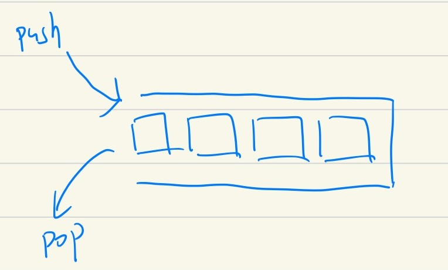

  Notice that *Stack* operates only on *one end*. The other end can be visualized as a *closed status* and we do not need to consider that. 

  <br>

- As a result, *Stack's* two ends can be described as *Top* and *Bottom*, we *ONLY* interact with *Top*. All three common operations: *Push/Pop/Peek* are all operating on *Top*.

  <br>

- That being said, *Stack* is particularly useful when you are only interested in the most recently-operated element *(which is just the TOP)*

​       <br>

### Stack Implementation:

```java
//StackADT Interface
public interface StackADT<T> {
    
    //Add a new element
    public void push(T newElement);
    
    //Remove and return an element
    public T pop();
    
    //Return the most-recently added element
    public T peek();
    
    public boolean isEmpty();
    
}
```

<br>

```java
//Stack class implemented with Array
public class Stack implements StackADT<String> {
    
    //Data fields
    private String[] data;
    private int top;  
    
    /* Note that we want the most efficient way of operations in
       Stacks, so the top will be at the last non-null element index,  
       instead of 0  */
    
    
    
    //Constructor
    public Stack(int capacity) {
        this.data = new String[capacity];
        this.top = -1;
    }
    
    
    @Override
    public void push(String newElement) {
        if (top == this.data.length) {
            throw new IllegalStateException("Stack is full!");
        }
        this.data[++top] = newElement;
    }
    
    
    @Override
    //Assume non-empty
    public String pop() {
        String toReturn = this.data[top];
        this.data[top] = null; //Initialize back to null
        
        this.top--;
        return toReturn;
    }
    
    
    @Override
    //Assume non-empty
    public String peek() {
        return this.data[top];
    }
    
    
    @Override
    public boolean isEmpty() {
        return this.data[0] == null;
    }
    
    
}
```

- *Push/Pop/Peek* above all in O(1), and still the same if implementing in an *ArrayList*.

<br>

### Queue:

- On the other hand, **Queue** follows *First In First Out (FIFO)* order. 

  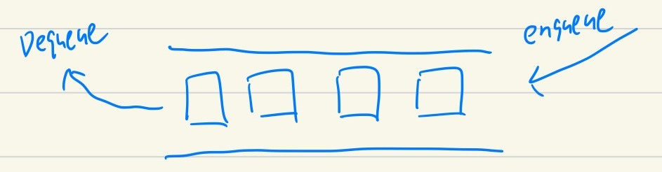

  Notice that *Queue* operates on *Two ends*. You add something from one end and remove something from another. That being said, *the first element being added will also be the first to be removed*. 

  <br>

- *Queue's* two ends can be describes as *front* and *back*. You add elements to *back*, remove elements from the *front* and peek elements from the *front*. 

  <br>

- That being said, the three common operations of a *Queue*: *Enqueue/Dequeue/Peek*. Normally, a *queue* can be implemented by 1. *LinkedList* or 2. *Circular Array*. 

  1. With a singly-LinkedList, the *front* is just the head, and the *back* is just the tail. All operations are in O(1).

  2. By *"Circular Array"*, it means *front* and *back* does not necessarily need to be at *index 0* or *index (length - 1)* of an array. Instead, think of them as a circle:

     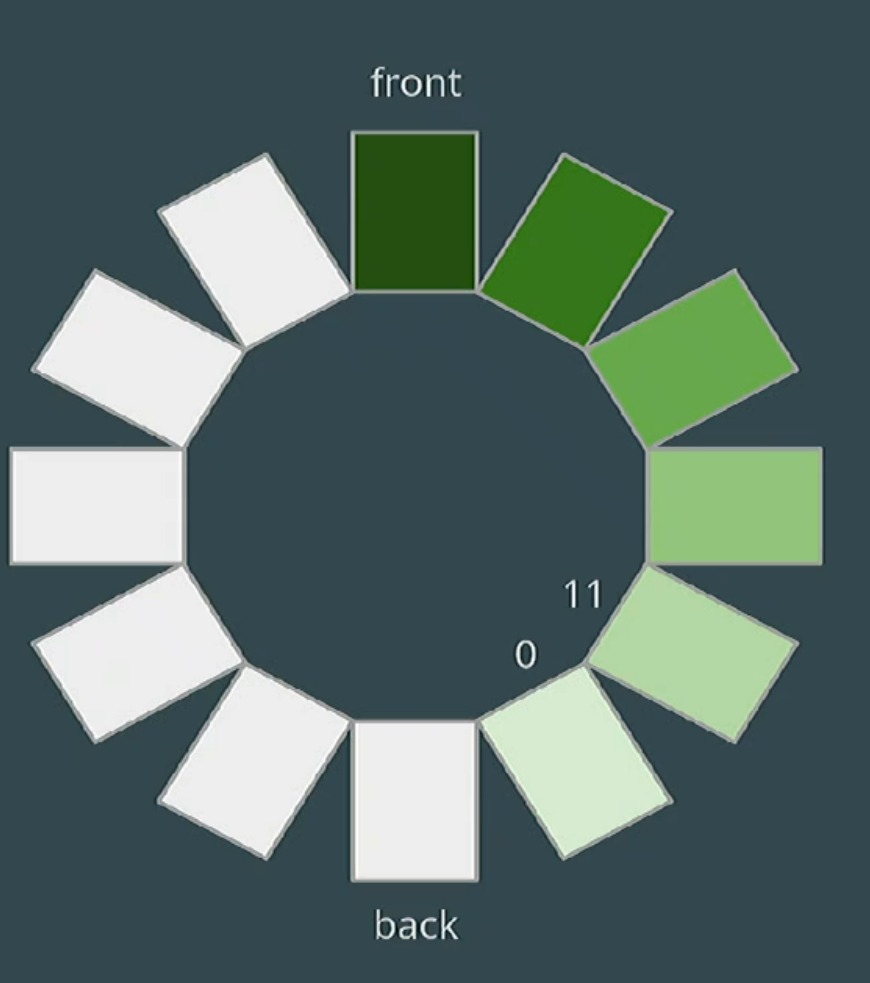

     We notice that the *front* is at index 7, while *back* is at index 11 (The last index of an array), adding one more element will wrap the *back* to index 0. Adding one more will cause *back* to be at index 1, etc. In this case, we DO NOT need to shuffle back and forth the elements in an array, thus all operations are in O(1).

<br>

### Queue Implementation:

```java
//QueueADT Interface
public interface QueueADT<T> {
    
    //Add to the back
    public void enqueue(T element);
    
    //Remove and return from the front
    public T dequeue();
    
    //Return the element from the front (Least recently-added)
    public T peek();
    
    public boolean isEmpty();
    
}
```

<br>

```java
//Queue class implemented using Circular Array
public class Queue implements QueueADT<String> {
    
    //Data fields
    private String[] data;
    private int front;  // index of the LEAST recently added thing
    private int back;   // index of the MOST recently added thing
    
    //Constructor
    public Queue(int capacity) {
        this.data = new String[capacity];
        
        this.front = -1;
        this.back = -1;
    }
    
    
    @Override
    public void enqueue(String element) {
        // Check if the queue is full
        if ((back + 1) % data.length == front) {
            throw new IllegalStateException("Queue is full");
        }
        
        back = (back + 1) % data.length;
        data[back] = item;
        
        //If this is the first element added
        if (front == -1) {
            front = back;
        } 
    }
    
    
    
    @Override
    public String dequeue() {
        if (this.isEmpty()) {
            throw new IllegalStateException("Invalid!");
        }
        
        String toReturn = this.data[front];
        this.data[front] = null;
        front = (front + 1) % data.length;
        
        //When this is the only element to be removed
        //Checks whether the new front has crossed the back
        if (front == back + 1 || 
            (front == 0 && back == data.length-1)) {
            front = -1;
            back = -1;
        }
        return toReturn;
    }
    
    
    @Override
    public String peek() {
        if (this.isEmpty()) {
            throw new IllegalStateException("Invalid!");
        }
        return this.data[front];
    }
    
    
    @Override
    public boolean isEmpty() {
        return this.front == -1 && this.back == -1;
    }

}
```

<br>


## Week 12: Iterators and Iterables

- **Motivation:** *Encapsulating* and *abstracting* the process of **iteration** through a data structure. In Java specifically, it gives you the ability to use an *Enhanced For Loop*.

<br>

- *Iterator* is a generics interface. We need an object to implement from this interface with two required methods: **hasNext()** and **next()**.
  - hasNext(): Returns true if the iteration has more elements. 
  - next(): Returns the next element in the iteration.
  - **Note:** hasNext() **checks whether there is a current element** instead of there is an element after the current one. 

<br>

- The thing we want to *iterate through* needs to implement an *Iterable*. All it needs to do is to give an iterator object that is set up to iterate itself. 

  <br>

- Some to notice for below is that in both *Stack* and *Stack_Iterator* classes, they are implementing from *Iterable or Iterator* of *STRING*. This is due to the nature of what actual *data* is stored in the data structure. The *Enhanced For Loop* will iterate on the *actual data* inside these structures. 

  <br>

  ### Iterator and Iterable Examples:

  ```java
  //Use Stack as the data strcuture for demo here:
  public class Stack implements StackADT<String>, Iterable<String> {
      
      //Data fields
      //Constructors
      //Methods
      
      //NEW:
      @Override
      public Iterator<String> iterator() {
          return new Stack_Iterator(new Stack(this));
      }
  
  }
  ```

  <br>

  ```java
  //Iterator class
  public class Stack_Iterator implements Iterator<String> {
      
      //Data field
      private StackADT<String> stack;
      
      //Constructor
      public Stack_Iterator(StackADT<String> stack) {
          this.stack = stack;
      }
      
      
      @Override
      public boolean hasNext() {
          return !this.stack.isEmpty();
      }
      
      
      @Override
      public String next() {
          if (!this.hasNext()) {
              throw new NoSuchElementException("Invalid!");
          }
          return this.stack.pop();
      }
      
  }
  ```

<br>


## Week 13: Binary Search Trees

- **Parent/Child Relationship:**

  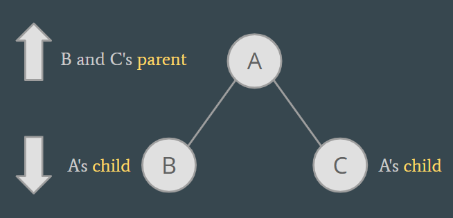

  <br>

- **Root** is the node at the top of the tree, in the above example: A. 

- **Leaf** is the node that has no children, in the above example: B/C.

- A **Binary Tree** indicates it can mostly have *TWO CHILDREN* of each node, no matter what level the node is at. 

- **Tree Height**: Two definitions are used in CS300.

  1. Number of nodes from *Root* to *The Farthest Leaf*.
  2. Number of edges from *Root* to *The Farthest Leaf*.

  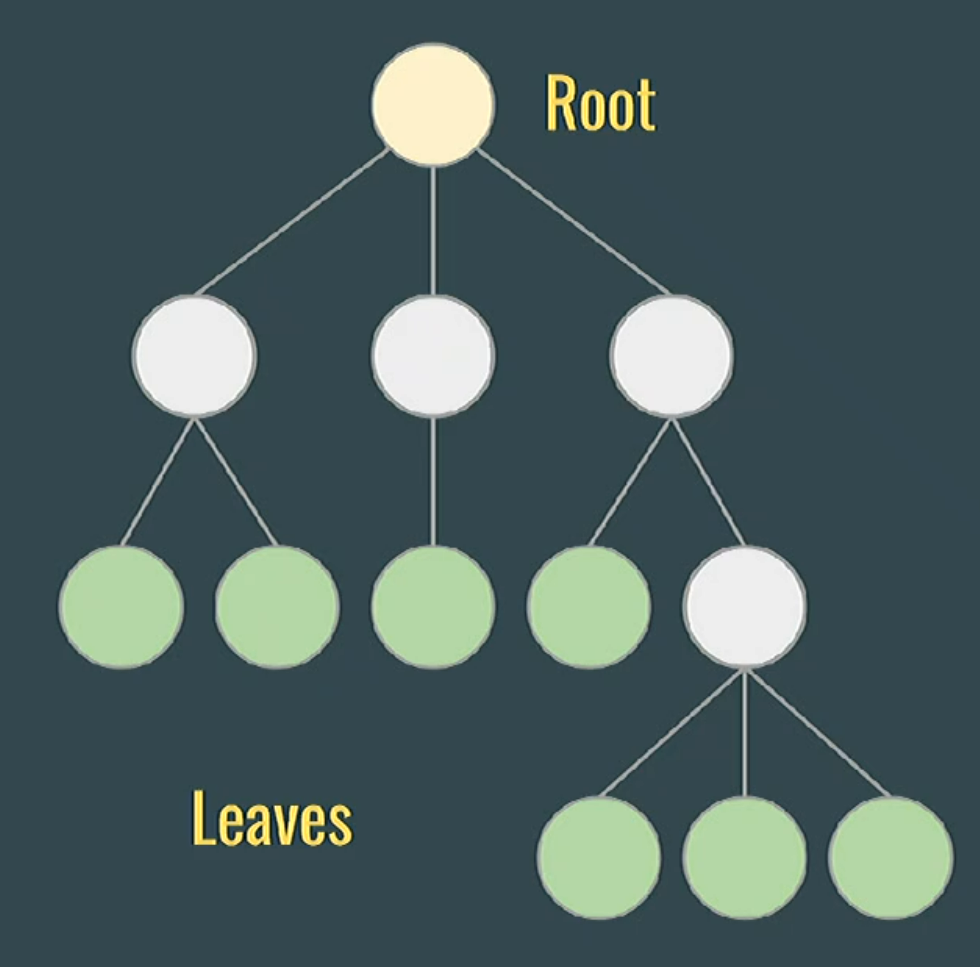

  In the above example: Number of Nodes is 4, while Number of edges is 3. 

  

- As you may have noticed, a *tree* is composed of *nodes*. Similar to a node within the *Doubly-LinkedList*, each node in a binary tree will have a *data* and *two references: Left and Right*. 

  <br>

- **Tree Traversals**:

  1. *In-order*: Left -> Self -> Right

  2. *Pre-order*: Self -> Left -> Right

  3. *Post-order*: Left -> Right -> Self

     ```markdown
                       20
                    /     \
                  10       30
                /   \     /   \
               5    15   25    35
              / \     \      /   \
             3   7     17   33    40
             
             
         //Pre-order: 20, 10, 5, 3, 7, 15, 17, 30, 25, 35, 33, 40
         //In-order: 3, 5, 7, 10, 15, 17, 20, 25, 30, 33, 35, 40
         //Post-order: 3, 7, 5, 17, 15, 10, 25, 33, 40, 35, 30, 20
     
     ```

<br>

- **Binary Search Trees:** BST is a special tree, of which the left subtree will be *smaller* than the current node and the right subtree will be *bigger*. That being said, given a valid BST, the *root node* will be the *middle value*, the smallest value will be at the *leftmost* location and the largest will be at the *rightmost*. 

  <br>

- As a result, when traversing a BST, *In-order* is the most common way, printing each value in the *increasing* order. 

  <br>

- **Time Complexity Analysis:**

  1. Adding/Removing a new element: O(logn).        *(Because we use binary search!)*
  2. Search for an element: O(logn).   *(Because we use binary search!)*
  3. **Note:** In the worst cases, when a BST is *unbalanced*, it is just a LinkedList, indicating that both *Adding/Removing* and *Looking-up* in O(n). 

   <br>

### BST Implementation:

```java
//TreeNode class
//Notice that MOSTLY THE SAME AS DOUBLY-LINKEDNODE !!!
public class TreeNode<T> {
    
    //Data fields
    private T data;
    private TreedNode<T> leftChild;
    private TreeNode<T> rightChild;
    
    //Constructor #1
    public TreeNode (T data) {
        this(data, null, null);
    }
    
    //Constructor #2
    public TreeNode (T data, TreeNode<T> left, TreeNode<T> right) {
        this.data = data;
        this.leftChild = left;
        this.rightChild = right;
    }
    
    //Accessors
    public T getData() {
        return this.data;
    }
    
    public TreeNode<T> getLeft() {
        return this.leftChild;
    }
    
    public TreeNode<T> getRight() {
        return this.rightChild;
    }
    
    //Mutators
    public void setLeft(TreeNode<T> left) {
        this.leftChild = left;
    }
    
    public void setRight(TreeNode<T> right) {
        this.rightChild = right;
    }

}

```

<br>

- If you notice carefully, for a BST, we actually do not need a separate class to represent it. A *TreeNode* class will suffice. As a result, we will not follow what Prof. Hobbes did in class (which is a complex and unnecessary way of dealing with BSTs). 

```java
//Continue with the above code segment
//We are still in TreeNode class right now

//For simplicity and intuitive demonstration, NO GENERICS INVOLVED BELOW!
public String inOrder() {
    if (this == null) {
        return "";
    }
    return this.getLeft().inOrder() + this.getData() + this.getRight().inOrder();
}


//Get the min value within a BST:
//GetMax has a similar logic, here we skip it
public String getMin() {
    TreeNode<String> current = this;
    
    while (current != null) {
        current = current.getLeft();
    }
    return current.getData();
}


//Check if it is a VALID BST
public boolean isValid() {
    //Base Case
    if (this == null) {
        return true;
    }
    
    //Recursive case
    if (!this.getLeft().isValid()) {
        return false;
    }
    if (!this.getRight().isValid()) {
        return false;
    }
    
    //Actual Logic:
    //Max at Left < Current < Min at Right
    if (this.getLeft() != null && this.getData().compareTo(getMax(this.getLeft())) < 0) {
        return false;
    }
    if (this.getRight() != null && this.getData().compareTo(getMin(this.getRight())) > 0) {
        return false;
    }
    
    return true;
}


//Find the height of a BST (Number of Nodes)
public int calcHeight() {
    //Base case
    if (this == null) {
        return 0;
    }
    
    int left = this.getLeft().calcHeight();
    int right = this.getRight().calcHeight();
    return 1 + Math.max(left, right);
}


//We will not cover 1. Finding Successor or 2. Removing a Node
//They are beyond the difficulty scale of the CS300 Exams
//You only need to be familiar with the main logic steps involved in such methods

    
}
```


<br>

## Week 14: Heap

- ***Heap*** is a data structure represented in *Binary Tree*, indicating each node will have at most two children. However, unlike *Trees*, *Heaps* are usually implemented in *Oversize Arrays*. 

<br>

- There are *Max Heap* and *Min Heap*:
  1. **Max Heap:** The value of the *parent node* is **greater than** the values of its children nodes. The *largest* element is at the *root*.
  
  2. **Min Heap:** The value of the *parent node* is **less than** the values of its children nodes. The *smallest* element is at the *root*.
  
  3. **Note:** Left children and right children of a node does not need to follow any order.  
  
     <br>

- You may wonder why we need a such data structure. It is because *Heaps* are particularly useful when realizing *Priority Queues*, in which each element has a priority associated with it. Elements with higher priority are served before those with lower. 


- But why don't we use BST instead? Remember BST has O(logn) on most of common operations. The reason is that *We want peek() and remove to be in CONSTANT Time*. 


- For simplicity, our example will only cover *Max-Heap*, since *Min-Heap* is similar to it. Three common operations in a *Heap*: 
  1. peek(): Return the *Root Node's value*, (Max-Heap: Max value / Min-Heap: Min value)
  2. add(): Add an element to the existing heap, *(Place the node at the next available location and percolate up to its desired location)*
  3. remove(): Remove the *Root node*, replace it with the *Last Leaf Node*, and *percolate down to its desired location.*

<br>

- **Time Complexity**:
  1. peek(): O(1)
  2. add(): O(logn)          *(Percolate up in one branch)*
  3. remove(): O(logn)  *(Percolate down in one branch each time, only choose one child to continue)*


```markdown
       50
      /  \
    30    40
   /  \   / \
  10  20 35  25
  /
 8
 
 //In such Max-Heap Example, when you want to represent it in an oversize array, it would be: [50, 30, 40, 10, 20, 35, 25, 8]
 
 //Instead of manually calculating which index the node will go, one trick here is simply go through the heap in TBLR rule (From top to bottom, from left to right)
 
 
 //Addition Example: Add a 11
       50
      /  \
    30    40
   /  \   / \
  10  20 35  25
  / \
 8  11


//Addition Example: Add a 56
       50                                50
      /  \                              /  \
    30    40                          30    40
   /  \   / \                        / \    / \
  10  20 35  25                     10 20  35  25
  /                                 / \
 8                                 8  56


       50                                50
      /  \                              /  \
    30    40                          56    40
   /  \   / \                        / \    / \
  56  20 35  25                     30 20  35  25
  / \                               / \
 8  10                             8  10


       56                        
      /  \                            
    50    40                         
   /  \   / \                       
  30  20 35  25    //Final Result                  
  / \                                
 8  10         


//Remove Example:
                     
       10                                50
      /  \                              /  \
    50    40                          10    40
   /  \   / \                        / \    / \
  30  20 35  25                     30 20  35  25
  /                                / 
 8                                8  


       50                                
      /  \                             
    30    40       //Final Result                 
   /  \   / \                       
  10  20 35  25                   
  /                                
 8                                
  
```

<br>

- Important information you need to know for a heap that is implemented in an oversize-array: 

  1. LeftChild Index of Current Node: (2 * i) + 1

  2. RightChild Index of Current Node: (2 * i) + 2

  3. Parent Index of Current Node: (i - 1) / 2

     <br>

### Heap Implementation:

```java
//Priority Queue ADT
//Remember we need to Compare each element's value against each other
//Thus the data type should be COMPARABLE
public interface PriorityQueueADT<T extends Comparable<T>> {
    
    public T peek();
    
    public T remove();
    
    public void add(T value);
    
    public boolean isEmpty();
}
```

<br>

```java
//Max Heap class
public class Heap implements PriorityQueueADT<Integer> {
    
    //Data Fields
    private int[] heap;
    private int size;
    
    //Constructor
    public Heap(int capacity) {
        this.heap = new heap[capacity];
        this.size = 0;
    }
    
    
    //Methods:
    @Override
    public boolean isEmpty() {
        return this.size == 0;
    }
    
    
    
    @Override
    public int peek() {
        if (this.heap.isEmpty()) {
            throw new IllegalArgumentException("Empty");
        }
        return this.heap[0];
    }
    
    
    
    @Override
    public int remove() {
        if (this.isEmpty()) {
            throw new NoSuchElementException("Empty Heap!");
        }
        
        int toReturn = this.heap[0];
        this.heap[0] = this.heap[this.size - 1];
        this.heap[this.size - 1] = null;
        
        this.size --;
        this.heapifyDown(0);
        return toReturn;
    }
    
    
    //Heapler method of remove()
    private void heapifyDown(int index) {
        int leftChildren = (2 * index) + 1;
	    int rightChildren = (2 * index) + 2;
	    int largerIndex = index;
        
        //Check left subtree
	  if (leftChildren < this.size && 
	      this.heap[leftChildren].compareTo(this.heap[largerIndex]) > 0) {
	    largerIndex = leftChildren;   
	  }
	  
	  //Check right subtree
	  if (rightChildren < this.size && 
          this.heap[rightChildren].compareTo(this.heap[largerIndex]) > 0) {
        largerIndex = rightChildren;   
      }
	  
      //We swap
	  if (largerIndex != index) {
	    int temp = this.heap[index];
	    this.heap[index] = this.heap[largerIndex];
	    this.heap[largerIndex] = temp;
	      
	    this.heapifyDown(largerIndex);
	  }     
    }
    
    //Here we will not illustrate the add(int value) and heapifyUp(int index)     
   //methods, if you could follow along the above logic, you should be 
   //already comfortable understanding the add(int value) logic since it is easier.
    
}
```

<br>


- **Heap Sort:** We first find the max (or min) element and swap it with the last (or first). We repeat the same process for the remaining elements.

  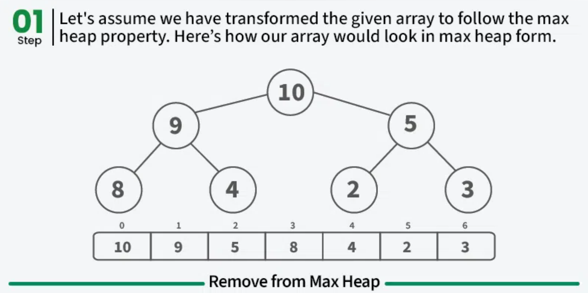

  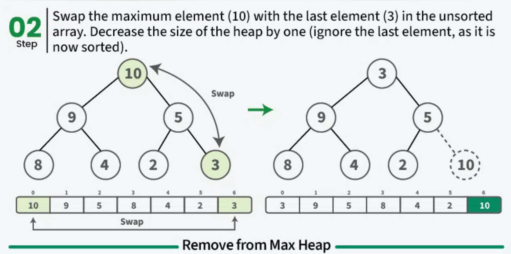

  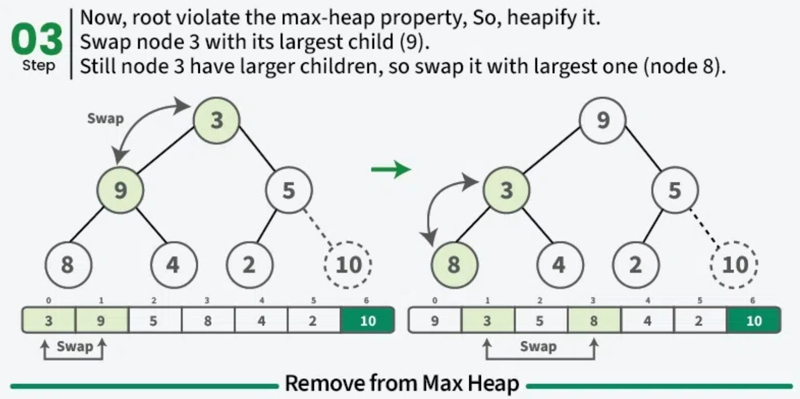

  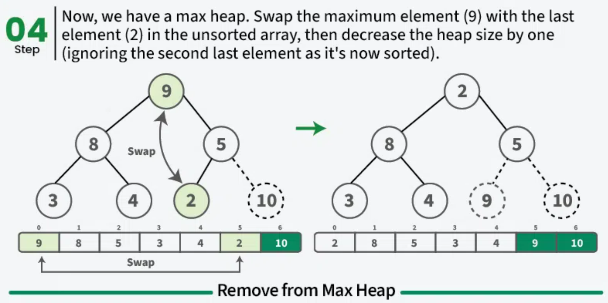

  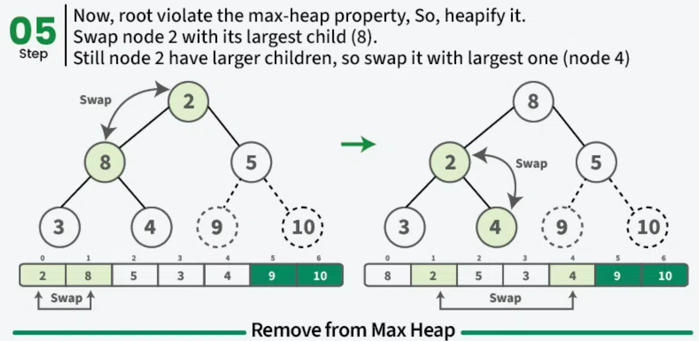

  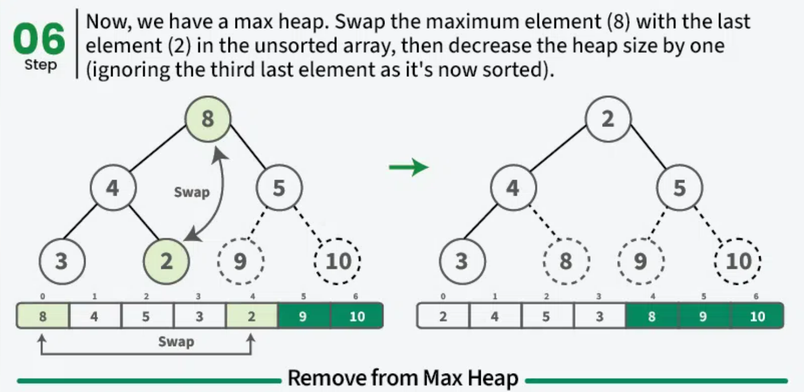

  <br>

  <br>

## Acknowledgment

*This Document is Created by **Zhiyuan Li** for Revision of CS300. It Serves as the Summary of Concepts Students are Expected to Know for the Unit Quiz 4*.


***Disclaimer:** Reading this Document Requires Intermediate Knowledge of the Concepts in CS300, It Does Not Serve as a Detailed Handbook. Besides, the Author Does Not Guarantee Quiz Outcomes after Walking through this Document, but You Should be Capable of Solving Most, if Not All, of the Challenging Questions that May Appear.* 
